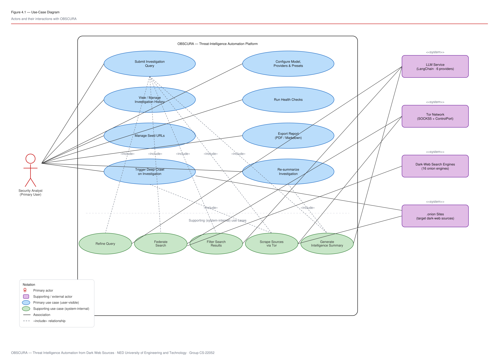
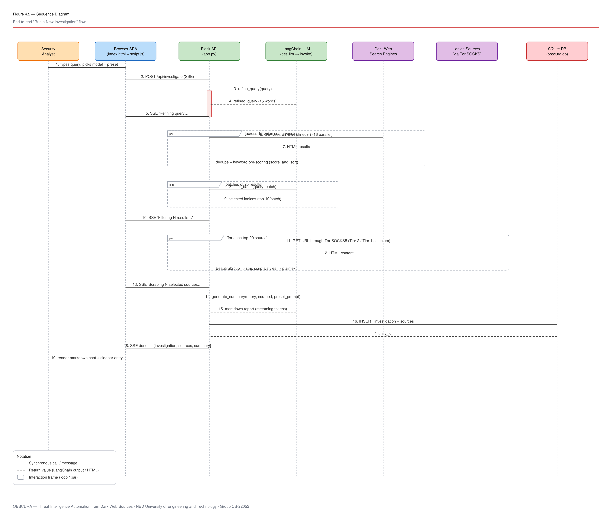
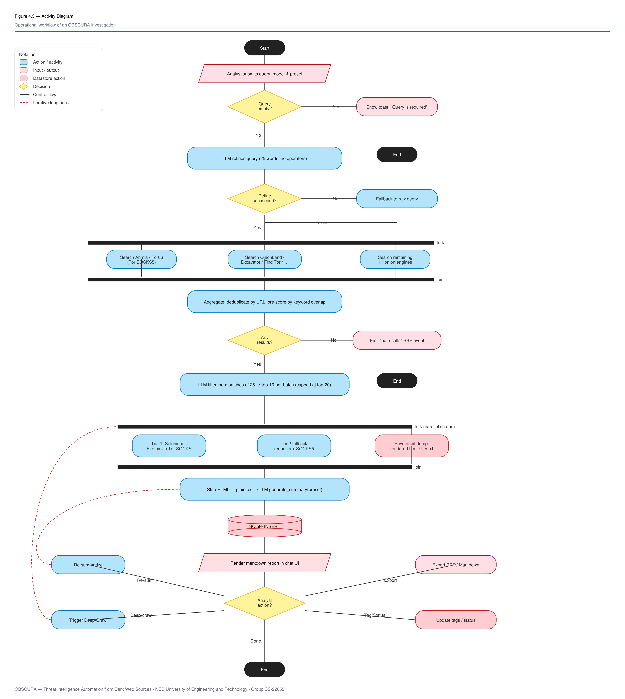
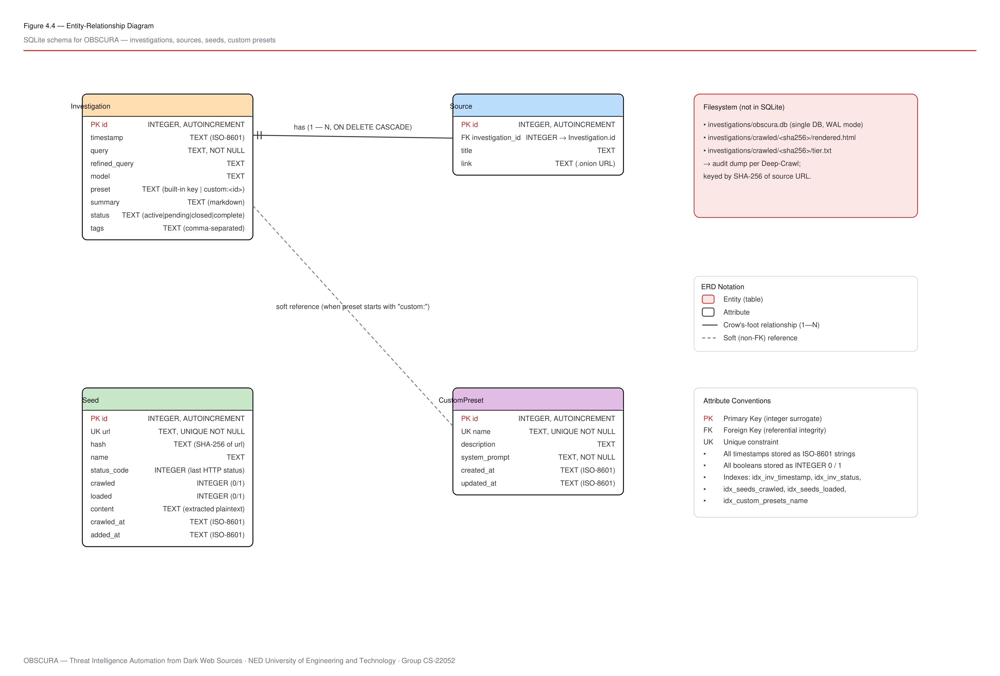
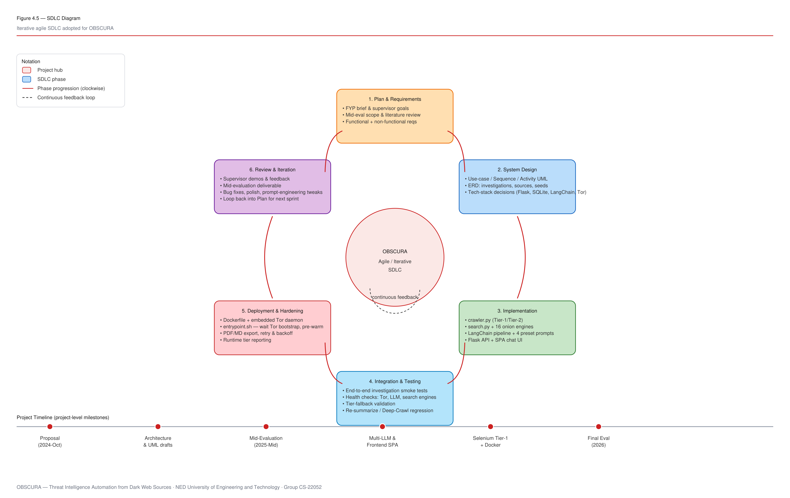
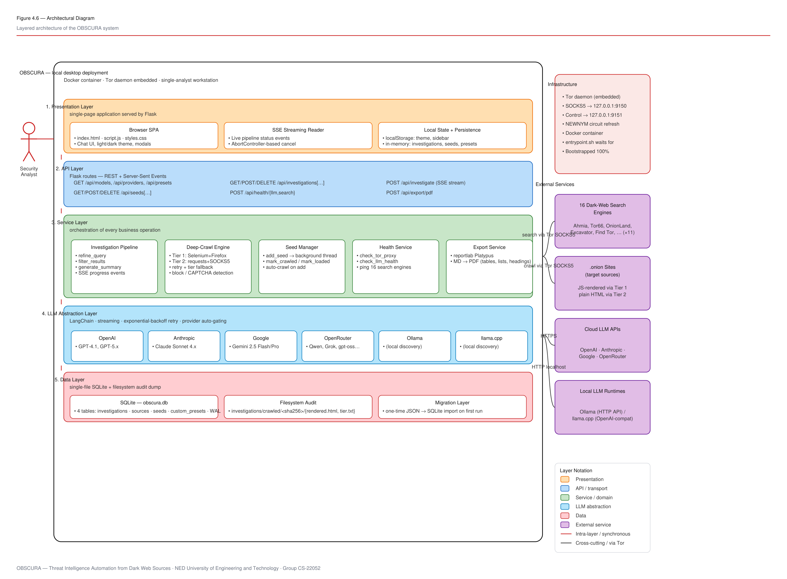

<!--
  Chapter 4 — System Design
  Embeds and explains the six diagrams generated in Phase 3:
    Fig 4.1 — Use-Case Diagram          (01-use-case-diagram.png)
    Fig 4.2 — Sequence Diagram          (02-sequence-diagram.png)
    Fig 4.3 — Activity Diagram          (03-activity-diagram.png)
    Fig 4.4 — ERD                       (04-erd.png)
    Fig 4.5 — SDLC Diagram              (05-sdlc-diagram.png)
    Fig 4.6 — Architectural Diagram     (06-architectural-diagram.png)
-->

# Chapter 4 — System Design

## 4.1 Introduction

This chapter sets out the design of OBSCURA through six complementary views. Each view captures a different aspect of the system and answers a specific design question: *Who uses the system and what can they do with it?* (Use-Case Diagram, §4.2); *How do the parts of the system interact at runtime during a typical investigation?* (Sequence Diagram, §4.3); *What is the operational control flow, end to end, with its decision points and parallel branches?* (Activity Diagram, §4.4); *What persistent data is stored and how is it related?* (Entity-Relationship Diagram, §4.5); *What lifecycle was followed to build the system?* (SDLC Diagram, §4.6); and *What does the deployed system look like as a layered architecture interacting with external services?* (Architectural Diagram, §4.7). Taken together, these six views form the complete design baseline against which the implementation in Chapter 5 is described.

All six diagrams use a consistent visual language. Human and software *actors* are coloured in warm orange; *user-visible use cases* are blue; *system-internal* operations are green; *external services* are purple; *data stores* and *datastore operations* are red; *decision* nodes are yellow; and *processes / activities* are light blue. The OBSCURA brand red (`#CC2222`) is reserved for emphasis and for the primary-actor highlight. A small legend on every diagram restates the notation locally so each figure is self-contained, and the figure caption follows the FYDP "Figure *Chapter.Index*" convention introduced in the *List of Figures*.

---

## 4.2 Use-Case Diagram

The Use-Case Diagram (Figure 4.1) identifies the actors that interact with OBSCURA and the discrete capabilities those actors can exercise. It serves as the bridge between the functional requirements of Chapter 3 and the runtime behaviour modelled in the remaining diagrams of this chapter.

**Figure 4.1 — Use-Case Diagram**

### 4.2.1 Actors

OBSCURA recognises one *primary* actor and four *supporting* (external-system) actors. The primary actor initiates investigations and consumes their results; the supporting actors participate in the realisation of those use cases without driving them.

- **Security Analyst (primary).** The single human user of the platform. The analyst submits investigation queries, configures the LLM model and prompt preset, manages seed URLs, reviews and re-summarises past investigations, exports reports, and runs health checks.
- **LLM Service.** The LangChain-mediated language-model layer. It is used three times per investigation — once to refine the query, again to filter the search results, and again to generate the structured summary — and may resolve to any of six concrete providers under the hood (OpenAI, Anthropic, Google Gemini, OpenRouter, Ollama, or llama.cpp).
- **Tor Network.** The anonymity transport. All egress traffic — both federated search requests and deep-crawl page fetches — is routed through Tor's local SOCKS5 proxy, with circuit rotation available through the ControlPort when needed.
- **Dark-Web Search Engines.** The federation of sixteen onion search engines (Ahmia, Tor66, OnionLand, Excavator, Find Tor, and eleven others) that OBSCURA queries concurrently for each refined query.
- **.onion Sites.** The actual dark-web sources that produce the textual content the LLM ultimately summarises.

### 4.2.2 Primary Use Cases

Eight primary use cases sit inside the system boundary and correspond directly to the functional requirements of §3.2:

1. **Submit Investigation Query** — the core analyst action; runs the full three-stage pipeline.
2. **Configure Model, Providers, and Presets** — selects the LLM model, manages prompt presets.
3. **View / Manage Investigation History** — sidebar browsing, search, tagging, status update.
4. **Run Health Checks** — probes Tor, the selected LLM, and the sixteen search engines.
5. **Manage Seed URLs** — adds, deletes, and re-crawls seeds in the Seed Manager modal.
6. **Export Report** — produces a typeset PDF or raw Markdown of any investigation.
7. **Trigger Deep-Crawl on Investigation** — re-fetches an investigation's sources with the Tier 1 selenium path.
8. **Re-summarise Investigation** — re-runs `generate_summary` against a saved investigation, optionally with a different model, prompt override, or custom instructions.

### 4.2.3 Supporting (System-Internal) Use Cases

Five smaller use cases are shown beneath the divider line in Figure 4.1. They are not user-facing in themselves, but they are *included* by the primary use cases above and are therefore explicit in the model so that the relationships between user-facing capabilities and underlying mechanics are visible.

- **Refine Query** — invoked by *Submit Investigation Query*. Compresses a free-text analyst query into a ≤ 5-word search-engine-friendly query.
- **Federate Search** — concurrent query across all sixteen onion search engines, deduplication, and keyword pre-scoring.
- **Filter Search Results** — LLM-driven selection of the top twenty results from the federated set.
- **Scrape Sources via Tor** — two-tier deep-crawl of the filtered URLs.
- **Generate Intelligence Summary** — preset-driven, structured Markdown report assembly.

### 4.2.4 Relationships and Notation

Solid lines denote *associations* between an actor and the use cases that actor participates in. The five external-system actors on the right side of Figure 4.1 are connected to the supporting use cases their service realises — *LLM Service* is associated with *Refine Query*, *Filter Search Results*, and *Generate Intelligence Summary*; *Tor Network* is associated with both *Federate Search* and *Scrape Sources*; *Dark-Web Search Engines* with *Federate Search*; and *.onion Sites* with both *Scrape Sources* and *Trigger Deep-Crawl*.

Dashed open-arrow lines denote *«include» relationships* between primary and supporting use cases. *Submit Investigation Query* includes all five supporting use cases; *Re-summarise Investigation* includes *Generate Intelligence Summary*; *Trigger Deep-Crawl on Investigation* includes *Scrape Sources via Tor*. The legend in the lower-left of Figure 4.1 restates this notation.

---

## 4.3 Sequence Diagram

The Sequence Diagram (Figure 4.2) traces the temporal order of messages exchanged between OBSCURA's runtime participants during the most important system flow — the end-to-end execution of a new investigation from analyst keystroke to rendered Markdown report.

**Figure 4.2 — Sequence Diagram — End-to-End "Run a New Investigation" Flow**

### 4.3.1 Lifelines

Seven participants are modelled, in left-to-right order: the **Security Analyst** (the human user), the **Browser SPA** (`index.html` + `script.js`), the **Flask API** (`app.py`), the **LangChain LLM** layer (`get_llm` → `invoke`), the **Dark-Web Search Engines** (the federation of sixteen onion engines), the **.onion Sources** (the actual content-producing dark-web sites, accessed via the Tor SOCKS5 proxy), and the **SQLite DB** (`obscura.db`). Each lifeline drops a dashed vertical line beneath its header indicating that the participant remains "live" throughout the interaction.

### 4.3.2 Message Flow

The interaction proceeds in nineteen numbered messages:

1. The analyst types a query and selects the model and preset.
2. The browser opens a streaming `POST /api/investigate` request to the Flask API.
3. The Flask API invokes `refine_query()` on the LLM.
4. The LLM returns a refined query (typically five words or fewer).
5. The Flask API emits an SSE event *"Refining query…"* to the SPA.
6–7. The Flask API issues sixteen parallel `GET /search?q=<refined>` requests through Tor; the engines return HTML result listings. This block is enclosed in a `par` interaction frame to indicate parallel dispatch, and the on-canvas annotation notes that deduplication and keyword pre-scoring (`score_and_sort`) follow the join.
8–9. The Flask API enters a `loop` interaction frame to filter results in batches of twenty-five, calling `filter_batch()` on the LLM and receiving the indices of the top ten results per batch.
10. An SSE event *"Filtering N results…"* is emitted.
11–12. A second `par` block dispatches deep-crawl fetches for each of the top twenty filtered sources through the Tor SOCKS5 proxy. The on-canvas annotation notes the BeautifulSoup-based stripping of scripts, styles, and other non-textual elements.
13. An SSE event *"Scraping N selected sources…"* is emitted.
14–15. The Flask API invokes `generate_summary()` on the LLM with the preset prompt and the concatenated scraped content; the LLM streams Markdown tokens back.
16–17. The Flask API persists the investigation (and its sources) to SQLite via an `INSERT` and receives the new row identifier.
18. A final SSE event carries the complete payload (investigation, sources, summary) to the SPA.
19. The SPA renders the Markdown summary in the chat surface and adds a new entry to the sidebar history.

### 4.3.3 Interaction Frames and Notation

Two notational devices are used throughout Figure 4.2. **Interaction frames** (the dashed-bordered rectangles labelled `par` or `loop`) group a set of messages that occur in parallel or iteratively respectively, with the guard condition shown in square brackets next to the kind tag. **Activation bars** (the narrow red rectangles overlaid on the Flask API lifeline at message 3 onward) indicate the periods during which the Flask API is actively executing on the analyst's behalf. Solid arrows denote synchronous calls; dashed arrows denote return values.

---

## 4.4 Activity Diagram

While the sequence diagram captures *what messages are exchanged between participants*, the activity diagram (Figure 4.3) captures *what happens inside the system as a single end-to-end control flow*, including the decision points and parallel branches that the sequence view abstracts away.

**Figure 4.3 — Activity Diagram — Operational Workflow of an OBSCURA Investigation**

### 4.4.1 Happy Path

The happy path runs vertically down the centre column of the diagram. From the *Start* terminator, the analyst submits a query, model selection, and preset (rendered as a parallelogram input/output node). The first decision diamond (*Query empty?*) gates against the trivial error case. The LLM refines the query; a second decision (*Refine succeeded?*) gates against transient LLM failure and rejoins via a *Fallback to raw query* path so that the pipeline never aborts purely because of a refinement timeout.

A *fork* bar then splits control across the federated-search activities — modelled as three representative branches in the diagram for visual clarity, but corresponding to all sixteen onion engines at runtime — and rejoins at the matching *join* bar. The aggregated results are deduplicated by URL and pre-scored by keyword overlap. A third decision (*Any results?*) guards against the empty-result edge case by short-circuiting to *Emit "no results" SSE event* and terminating gracefully. Otherwise, the LLM filter loop selects the top twenty.

A second fork bar dispatches the parallel scrape: Tier 1 (Selenium + Firefox via Tor SOCKS) and Tier 2 (`requests` + SOCKS5) are shown side by side because at run time the Deep-Crawl Engine chooses between them per-URL with fallback. The third branch — *Save audit dump: rendered.html / tier.txt* — runs concurrently with the scrape and produces the on-disk forensic trail. After the join, the extracted plain text is fed into `generate_summary`, the result is persisted via SQLite `INSERT`, and the Markdown report is rendered in the chat UI.

### 4.4.2 Analyst-Iteration Branches

The diamond labelled *Analyst action?* at the bottom of the diagram encodes the four post-completion options the analyst has on any investigation. Three of them — *Re-summarise*, *Trigger Deep-Crawl*, and *Done* — are drawn explicitly with their return paths. The two dashed red arrows on the left edge of the diagram show the *iterative loop-back* behaviour: *Re-summarise* re-enters the activity flow at the *LLM generate_summary* step (re-using the previously scraped content), while *Trigger Deep-Crawl* re-enters at the parallel scrape fork (re-fetching all sources, this time forcing Tier 1). The *Export PDF / Markdown* and *Update tags / status* branches are external to the main flow and are shown ending at independent terminators on the right.

### 4.4.3 Notation

Rounded blue rectangles are *actions / activities*; pink parallelograms are *input / output*; pink cylinder-shaped nodes are *datastore actions*; yellow diamonds are *decisions*; black bars are *fork / join synchronisation*; black pill nodes are *Start* and *End* terminators; solid black arrows are *control flow*; dashed red arrows are *iterative loop-back to a prior activity*. The notation key is restated in the upper-left legend.

---

## 4.5 Entity-Relationship Diagram

The Entity-Relationship Diagram (Figure 4.4) defines the persistent data model used by OBSCURA. All durable state is held in a single SQLite database file, `investigations/obscura.db`, with WAL journalling enabled and foreign-key enforcement turned on. A small filesystem audit area complements the database for forensic purposes.

**Figure 4.4 — Entity-Relationship Diagram — SQLite Schema for OBSCURA**

### 4.5.1 Entities

OBSCURA's database contains four tables.

- **`Investigation`.** The first-class object of the analyst workflow. Each row records a single investigation with its `id` (auto-increment primary key), `timestamp`, raw `query`, LLM-`refined_query`, `model` selected, `preset` used (either a built-in key like `threat_intel` or a `custom:<id>` reference), the full Markdown `summary`, a `status` from `{active, pending, closed, complete}`, and a free-form comma-separated `tags` string.

- **`Source`.** A single dark-web source referenced by an investigation. Each row stores the `investigation_id` foreign key (with `ON DELETE CASCADE`), the source `title`, and the source `link` (typically an `.onion` URL).

- **`Seed`.** A standalone seed URL maintained by the analyst through the Seed Manager. Each row carries a unique `url` (with its SHA-256 `hash` for stable identification across re-crawls), a human-readable `name`, the last HTTP `status_code` observed, two boolean flags `crawled` and `loaded`, the extracted plain-text `content`, and ISO-8601 `crawled_at` and `added_at` timestamps.

- **`CustomPreset`.** A user-authored prompt-domain preset that supplements the four built-in research domains. Each row has a unique `name`, an optional `description`, the actual `system_prompt` text, and `created_at` / `updated_at` timestamps.

### 4.5.2 Relationships

The diagram models two relationships:

- **`Investigation` ⟨1 — N⟩ `Source`** (crow's-foot notation, `ON DELETE CASCADE`). Each investigation owns a list of sources; deleting an investigation cascades the deletion of its sources, preventing orphan rows.
- **`Investigation.preset` ⤳ `CustomPreset.id`** (dashed open-arrow soft reference). When the `preset` value starts with the prefix `custom:`, the suffix is the primary key of the corresponding `CustomPreset` row. This is *not* a database-enforced foreign key — it is a string convention that lets investigations refer either to a built-in key (e.g. `threat_intel`) or to a custom preset without a schema change.

### 4.5.3 Filesystem Audit

The block in the upper-right of Figure 4.4 records the on-disk artefacts that complement the database. The directory `investigations/crawled/<sha256>/` contains two files for every successfully deep-crawled source: `rendered.html` (the raw rendered HTML at the time of capture, preserved for forensic re-analysis) and `tier.txt` (a one-line marker recording which crawler tier produced the capture). The directory is keyed by the SHA-256 hash of the source URL so that the same source always maps to the same audit directory irrespective of its position in the database.

### 4.5.4 Attribute Conventions

The lower-right card in Figure 4.4 makes the attribute conventions explicit. **PK** denotes a primary key (always an integer surrogate); **FK** denotes a foreign key with referential integrity; **UK** denotes a unique constraint. All timestamps are stored as ISO-8601 strings. Booleans are stored as `INTEGER 0` / `INTEGER 1`. Five indexes are created at schema-init time: `idx_inv_timestamp`, `idx_inv_status`, `idx_seeds_crawled`, `idx_seeds_loaded`, and `idx_custom_presets_name`.

---

## 4.6 SDLC Diagram

The SDLC Diagram (Figure 4.5) shows the iterative agile software-development life cycle that the OBSCURA team followed throughout the project. The methodology and its six phases are described in detail in Section 1.4; this section restates them visually and aligns the cycle with the project's external milestones.

**Figure 4.5 — SDLC Diagram — Iterative Agile SDLC Adopted for OBSCURA**

### 4.6.1 The Six-Phase Cycle

Six phases are arranged clockwise around the central *OBSCURA — Agile / Iterative SDLC* hub.

1. **Plan & Requirements** — FYP brief, supervisor goals, mid-evaluation scope, literature review, and the elicitation of functional and non-functional requirements.
2. **System Design** — UML diagrams (use-case, sequence, activity), ERD, and the explicit technology-stack decisions (Flask, SQLite, LangChain, Tor) that justify the rest of the design.
3. **Implementation** — the seven sprints described in Section 1.4.4: crawler MVP, linear LLM pipeline, multi-provider abstraction, Flask API and SPA, SQLite persistence, Tier 1 selenium, polish and Docker.
4. **Integration & Testing** — end-to-end investigation smoke tests, the health-check probes for Tor / LLM / search engines, validation of the tier-fallback path, and regression testing of the re-summarise and deep-crawl features.
5. **Deployment & Hardening** — the Docker container with the embedded Tor daemon, the `entrypoint.sh` synchronisation logic, the PDF and Markdown export pipeline, the retry-and-backoff hardening, and the runtime tier-reporting banner.
6. **Review & Iteration** — supervisor demonstrations, mid-evaluation feedback, bug fixes, and prompt-engineering refinements. The output of this phase loops back into *Plan & Requirements* to seed the next sprint.

Red curved arrows around the perimeter indicate the clockwise progression of phases. A small dashed loop inside the hub captures the *continuous feedback* property of the methodology — every phase can re-enter every earlier phase as new information becomes available.

### 4.6.2 Project Timeline

The horizontal timeline beneath the cycle records the project's external milestones: the *Proposal* (October 2024), the production of the initial *Architecture & UML drafts*, the *Mid-Evaluation* (mid-2025), the *Multi-LLM & Frontend SPA* sprint that consumed the second half of 2025, the *Selenium Tier-1 + Docker* sprint, and the *Final Evaluation* (2026). Each milestone marker on the timeline corresponds to a complete pass through the six-phase cycle in the upper part of the figure.

---

## 4.7 Architectural Diagram

The Architectural Diagram (Figure 4.6) presents OBSCURA as a layered application running inside a Docker container with a small set of well-defined external dependencies. It is the most important design view for understanding how the components implemented in Chapter 5 fit together.

**Figure 4.6 — Architectural Diagram — Layered Architecture of the OBSCURA System**

### 4.7.1 Five Application Layers

The OBSCURA application is organised as five horizontal layers. Each layer is a strict consumer of the layer beneath it; cross-layer skipping is avoided in the source code so that any single layer can be replaced (for example, an alternative frontend or an alternative persistence layer) without disturbing the others.

- **1. Presentation Layer.** The browser-resident single-page application — `index.html`, `script.js`, `styles.css` — providing the chat UI, the SSE streaming reader (an `AbortController`-cancellable `fetch` over the SSE stream), and local state including `localStorage`-persisted theme and sidebar-collapse preferences plus in-memory caches of investigations, seeds, and presets.

- **2. API Layer.** A Flask application exposing a REST + SSE surface. The endpoints (visible inside the API band in Figure 4.6) cover the model and provider list, presets, investigations and their metadata, seeds, health checks, the main `/api/investigate` SSE stream, and the PDF export sink.

- **3. Service Layer.** Five subsystems implement the operational logic of the platform: the **Investigation Pipeline** (`refine_query`, `filter_results`, `generate_summary` with SSE progress events); the **Deep-Crawl Engine** (Tier 1 Selenium + Firefox, Tier 2 `requests` + SOCKS5, retry + tier fallback, block / CAPTCHA detection); the **Seed Manager** (`add_seed` → background thread, `mark_crawled` / `mark_loaded`, auto-crawl on add); the **Health Service** (`check_tor_proxy`, `check_llm_health`, per-engine pings for all sixteen onion search engines); and the **Export Service** (`reportlab` Platypus converting Markdown to a paginated PDF with tables, lists, and headings).

- **4. LLM Abstraction Layer.** A LangChain-mediated dispatching layer that exposes a single uniform interface upward while routing downward to one of six concrete providers — OpenAI (GPT-4.1, GPT-5.x), Anthropic (Claude Sonnet 4.x), Google (Gemini 2.5 Flash / Pro), OpenRouter (Qwen, Grok, gpt-oss, and others), Ollama (any locally discovered model), and llama.cpp (any locally served OpenAI-compatible endpoint). The dispatcher implements token streaming, exponential-backoff retry on transient errors, and automatic gating of providers by API-key presence.

- **5. Data Layer.** A SQLite database with four tables, opened in WAL journal mode and accessed through Python's standard `sqlite3` module. Alongside SQLite, the *Filesystem Audit* component records `rendered.html` and `tier.txt` per crawled source, and the *Migration Layer* handles the one-time import of legacy `investigation_*.json` files into the database on first run.

Red downward arrows along the inner-left margin of Figure 4.6 indicate the strict top-to-bottom dependency direction.

### 4.7.2 Infrastructure Side-Rail

A separate panel in the upper-right of the system frame lists the infrastructure on which the layered application depends: the embedded **Tor daemon**, exposing SOCKS5 on `127.0.0.1:9150` and the ControlPort on `127.0.0.1:9151`, with `SIGNAL NEWNYM` available for circuit rotation. The whole stack is packaged as a single Docker container whose `entrypoint.sh` waits for Tor's *Bootstrapped 100%* signal before exposing the SPA.

### 4.7.3 External Services

Four classes of external service sit outside the system frame on the right of Figure 4.6, with cross-cutting arrows indicating which layer talks to each:

- **Sixteen Dark-Web Search Engines** — accessed by the Service Layer's *Investigation Pipeline* through Tor SOCKS5.
- **.onion Sites (target sources)** — accessed by the *Deep-Crawl Engine* through Tor SOCKS5.
- **Cloud LLM APIs** — OpenAI, Anthropic, Google, and OpenRouter, accessed by the *LLM Abstraction Layer* over standard HTTPS.
- **Local LLM Runtimes** — Ollama (HTTP API) and llama.cpp (OpenAI-compatible endpoint), accessed by the *LLM Abstraction Layer* over plain HTTP on localhost.

The Security Analyst is shown as a stick figure to the left of the application, connected by a red association arrow to the Presentation Layer — the single human entry point into the system.

---

## 4.8 Summary

This chapter has presented the complete system design of OBSCURA through six complementary views. The Use-Case Diagram (Figure 4.1) named the one primary actor, four supporting actors, eight primary use cases, and five supporting use cases that collectively realise the functional requirements of Chapter 3. The Sequence Diagram (Figure 4.2) traced the nineteen-message interaction across the seven runtime participants of an end-to-end investigation. The Activity Diagram (Figure 4.3) made the operational control flow — including decision points, parallel forks, and the post-completion analyst-iteration loop-backs — explicit. The Entity-Relationship Diagram (Figure 4.4) defined the four-table SQLite schema (`investigations`, `sources`, `seeds`, `custom_presets`), the crow's-foot `1 — N` relationship and `ON DELETE CASCADE` between `investigations` and `sources`, the soft `preset → CustomPreset` reference, and the complementary filesystem audit dump. The SDLC Diagram (Figure 4.5) rendered the six-phase iterative methodology that produced the platform and aligned it with the project's external milestones. The Architectural Diagram (Figure 4.6) brought the five application layers, the embedded Tor infrastructure, and the four classes of external service together into a single deployable picture. With the design baseline now established, Chapter 5 turns to the implementation: how each of these design elements was realised in code.
